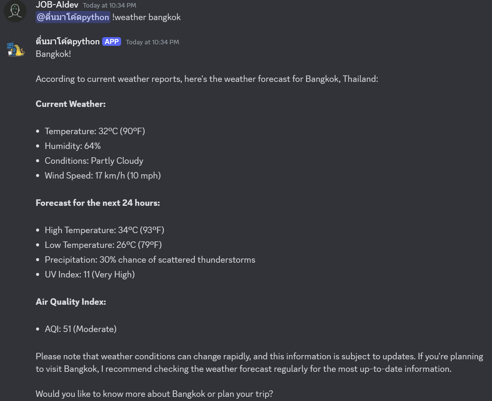
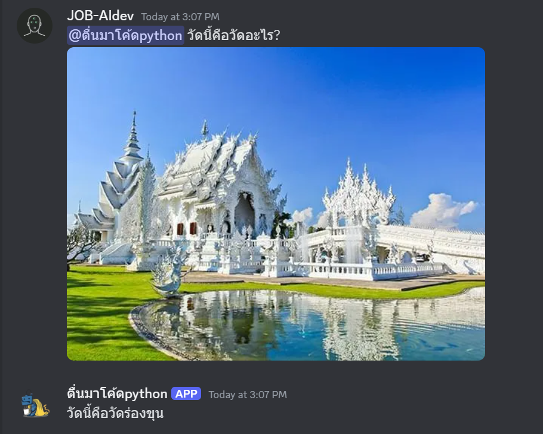

# Groq Discord Bot

[](https://github.com/spped2000/GroqDiscordAssistant/stargazers)
[](https://github.com/spped2000/GroqDiscordAssistant/fork)
[](https://opensource.org/licenses/MIT)

A Discord bot that integrates with Groq's LLM API to provide AI-powered question answering and assistance. Users can interact with different AI models through mentions or commands, maintaining conversation context across interactions. Now with vision capabilities to analyze images and real-time weather information!

## 📰 News
- 🌦️ **16/3/2025** - Added weather agent for real-time weather forecasts using PydanticAI and Tomorrow.io API!
- 🖼️ **14/3/2025** - Added vision capabilities to analyze images

## 🚀 Quick Links
- [⭐ Star this repo](https://github.com/spped2000/GroqDiscordAssistant/stargazers) เพื่อเป็นกำลังใจให้ผู้พัฒนา!
- [🍴 Fork this repo](https://github.com/spped2000/GroqDiscordAssistant/fork) เพื่อนำไปพัฒนาต่อ!
- [📝 Report issues](https://github.com/spped2000/GroqDiscordAssistant/issues) ถ้าเจอข้อผิดพลาดหรือบัค

## How It Works
<p align="center">
  <a href="https://www.kaggle.com/learn" target="_blank">
    
  </a>
</p>

## Features
- Ask AI questions by mentioning the bot
- **NEW**: Get real-time weather forecasts for any location (16/3/2025)
- Analyze images by attaching them to your messages
- Choose from multiple AI models, including vision models
- Simple command interface
- Handles long responses automatically

## Quick Start
### Requirements
- Python 3.8+
- Discord Bot Token
- Groq API Key
- Tomorrow.io Weather API Key (for weather functionality)
- Geocode Maps API Key (for location services)

### Installation
1. **Clone or download this repository**
   ```bash
   git clone https://github.com/spped2000/GroqDiscordAssistant.git
   cd GroqDiscordAssistant
   ```
2. **Install dependencies**
   ```bash
   pip install -r requirements.txt
   ```
3. **Set up environment variables**
   - Copy `.env.example` to `.env`
   - Add your Discord token, Groq API key, and weather API keys
4. **Run the bot**
   ```bash
   python bot.py
   ```

## Usage
### Basic Usage
Just mention the bot with your question:
```
@YourBot What's the capital of France?
```

*Example: @ตื่นมาโค้ดpython แนะนำอาหารไทยเผ็ดๆหน่อย?*

### Weather Information
Ask the bot about the weather in any location:
```
@YourBot What's the weather in Bangkok?
```
Or use the dedicated weather command:
```
!weather Bangkok
```


*Example: @ตื่นมาโค้ดpython !weather bangkok*

### Text Chat Examples
#### General Knowledge Queries
You can ask the bot general knowledge questions:
```
@YourBot Who wrote the novel "Pride and Prejudice"?
@YourBot What are the main causes of climate change?
```
#### Using Different Models
Specify a model for different types of responses:
```
!groq "Explain quantum computing in simple terms" model:llama3-70b-8192
!groq "Write a short poem about technology" model:mixtral-8x7b-32768
```
#### Complex Tasks
The bot can handle more complex tasks as well:
```
@YourBot Can you summarize the key differences between machine learning and deep learning?
@YourBot How would you explain the concept of blockchain to a 10-year-old?
```

### Vision Capabilities
Attach an image and mention the bot with your question about the image:
```
@YourBot [image attached] What's in this image?
```

*Example: @ตื่นมาโค้ดpython วัดนี้คือวัดอะไร?*

### Commands
- `!groq <prompt>` - Ask a text question
- `!groq <prompt> model:<model>` - Use a specific text model
- `!vision <prompt>` - Ask about your most recently uploaded image
- `!vision <prompt> model:<model>` - Use a specific vision model
- `!weather <location(s)>` - Get weather for one or more locations
- `!models` - List available models
- `!bothelp` - Show help information

### Available Models
#### Text Models
- `llama-3.1-8b-versatile` - Fastest responses
- `llama-3.1-70b-versatile` - Most capable (default for text)
- `llama-3.1-405b-versatile` - Highest quality responses
- `mixtral-8x7b-32768` - Good for longer contexts
- `gemma-7b-it` - Google's model

#### Vision Models
- `llama-3.1-8b-vision` - Default for images

## Weather Feature Details
The bot uses PydanticAI with Groq LLM to create a powerful weather agent that:

1. **Processes natural language** - Ask about weather in any way you want
2. **Supports multiple locations** - Check weather in several places at once
3. **Provides accurate data** - Uses Tomorrow.io API for real-time weather information
4. **Shows detailed information** - Temperature, conditions, humidity, and wind speed

### How the Weather Agent Works
1. The agent extracts location names from your query
2. It gets the coordinates using the Geocode Maps API
3. It fetches weather data from Tomorrow.io
4. The Groq LLM formats this data into a natural language response

### Weather Command Examples
```
!weather Bangkok
!weather Tokyo, Paris, New York
@YourBot What's the weather like in London today?
@YourBot Is it raining in Seattle?
```

## Vision Examples
### Analyzing Images
The bot can now analyze images and answer questions about them:
- Describe scenes and objects
- Identify text in images
- Answer questions about image content

### Using the Vision Command
If you've already shared an image, you can use the dedicated command:
```
!vision What can you tell me about this image?
```
This will analyze your most recently uploaded image.

## Contributing
Contributions are welcome! Here's how you can contribute:

1. Fork the repository
2. Create a new branch (`git checkout -b feature/amazing-feature`)
3. Make your changes
4. Commit your changes (`git commit -m 'Add some amazing feature'`)
5. Push to the branch (`git push origin feature/amazing-feature`)
6. Open a Pull Request

## License
MIT License

---

Made with ❤️ using Hikari, Lightbulb, PydanticAI, and Groq
